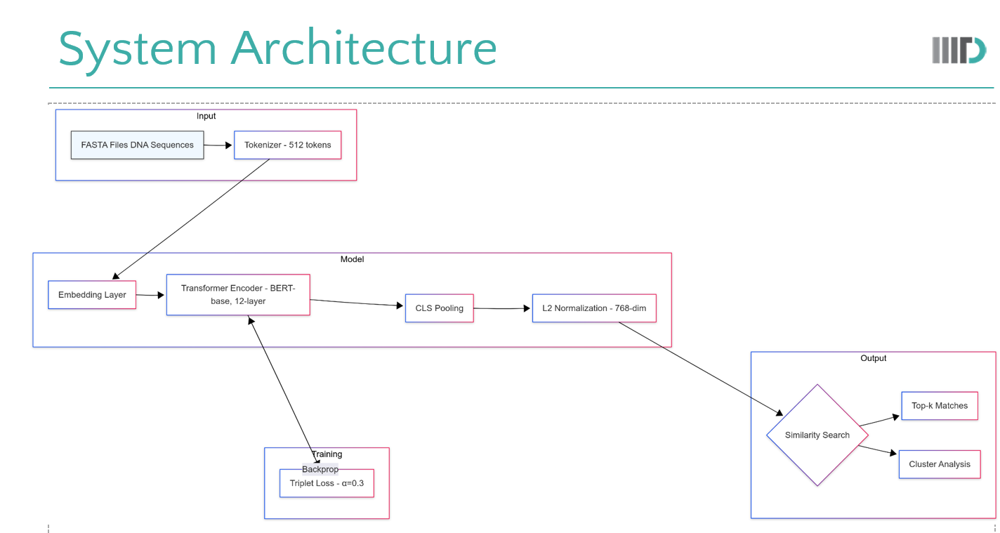

# Transformer-Based DNA Sequence Similarity Search

This repository contains the implementation of a Transformer-based model (BERT) for DNA sequence similarity search. The goal was to create a faster, alignment-free alternative to tools like BLAST by using neural embeddings.

## Project Description

Standard tools like BLAST rely on sequence alignment, which is computationally expensive ($O(N)$) and can be slow for large databases. This project uses Deep Learning to generate numerical embeddings (fingerprints) for DNA sequences. This allows us to find similar sequences using nearest-neighbor search in Euclidean space, which is an $O(1)$ operation.

We used a pre-trained **BERT-base** model fine-tuned with **Triplet Loss** to ensure that functionally similar sequences cluster together.

## Architecture & Method

The pipeline consists of the following steps:

* **Input**: DNA sequences tokenized into 512-token chunks.
* **Model**: BERT-base-uncased (12 layers, 768 hidden size).
* **Pooling**: Used `[CLS]` token pooling to get a single vector per sequence.
* **Normalization**: L2 Normalization applied to embeddings.
* **Training Objective**: Triplet Loss with a margin ($\alpha$) of 0.3.



## Repository Structure

* `notebooks/`: Contains `DNA_Similarity_Search.ipynb`, which has the training loop, model definition, and evaluation code.
* `data/`: Directory for storing FASTA files or CSV datasets.
* `images/`: Figures used in the report and README.
* `docs/`: The full project report and presentation slides.

## Setup and Usage

### Prerequisites
Install the required libraries:
```bash
pip install -r requirements.txt
